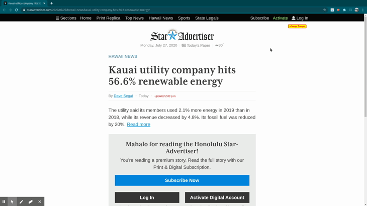

# StarFree

**A Google Chrome Extension to Read Star Advertiser Premium Articles For Free**

## Setup
In order to use this Google Chrome extension, you'll need to download the project onto your computer. 
You can do this by downloading the .zip file and then extracting it to a folder.

Before you can load this extension into Google Chrome, you'll have to enable "Developer mode" by typing in "chrome://extensions/" into the search bar and enabling the setting there. 

Once you have Developer mode enabled, click "Load unpacked" on the "chrome://extensions/" page and select the folder you previously unzipped the project to. You should see StarFree now in your extensions toolbar (you may first need to click on your extensions toolbar and pin StarFree before you can see it there).

## Using StarFree
Whenever you navigate to [Star Advertiser](https://www.staradvertiser.com/), and click on a Premium Article, the article will automatically be unlocked for you to read!

